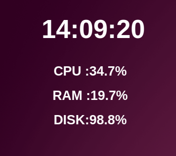

# ubuntuWidget 

<h1> Skrypt dodajacy na Pulpit czas i uzycie zasobów </h1>

<h1> Isntrukcjie instalacji zależności </h1>
 
 <h2> instalcjia pythona</h2>
 <code>sudo apt-get install python3 <code>

 <h2> instalcjia bibloteki psutil</h2>
 <code> pip install psutil <code>

 <h1> Uruchamianie programu  </h1>
 <code>python3 widget.py<code>